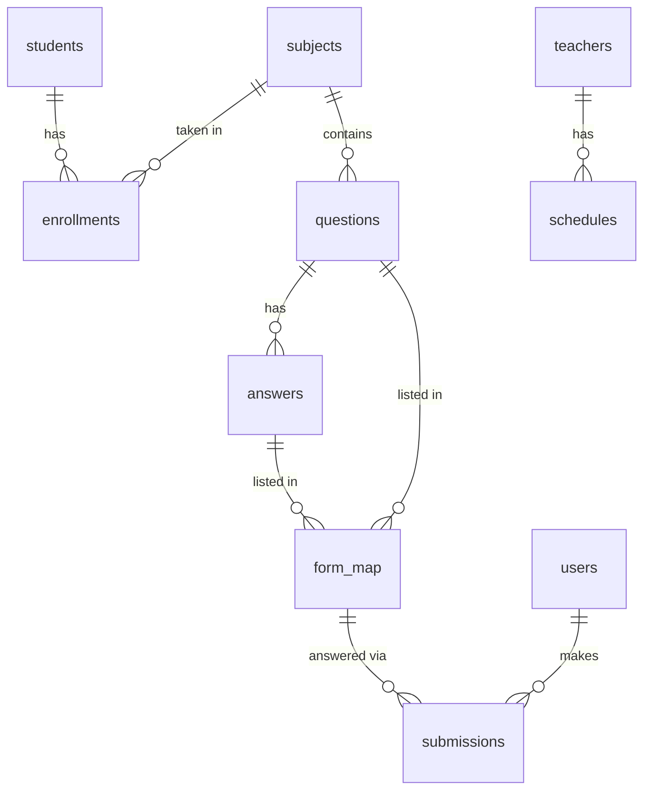

# CTU LMS — Backend (Laravel API)

The REST API behind **CTU LMS**, a school management system for CTU (Cebu
Technological University). It stores the student and teacher records, subjects,
enrolments, class schedules, events, announcements and quizzes.

| | |
| --- | --- |
| Framework | Laravel 10 on PHP `^8.1` (the Docker image runs 8.2) |
| Auth | Laravel Sanctum bearer tokens plus a `role` middleware |
| Database | PostgreSQL |
| Transport | AES-256-CBC encrypted JSON bodies (see [Response envelope](#response-envelope)) |
| Frontend | separate Vue 3 SPA — <https://github.com/paws1234/lmsfrontend> |

## Who can do what

Every account is a row in `users` with a `role`, and each role also has a
profile row (`students` or `teachers`) that most of the API looks it up by
`user_id`.

| Role | Profile row | Manages |
| --- | --- | --- |
| `admin` | — | students, teachers, courses, schedules, events |
| `teacher` | `teachers` | own subjects, enrolments, todos (announcements), questions |
| `student` | `students` | own tasks, submissions, scores |

**A `users` row without its profile row is a broken account** — `/api/student/stats`,
`/api/student/scores` and every teacher endpoint answer `404` until it exists.
`POST /api/register` and the admin's "add student/teacher" flow both create the
pair inside a transaction so it cannot happen that way, but it *can* happen if
you insert a user by hand (e.g. in tinker).

## Getting started

### Docker (recommended)

```bash
docker compose up -d --build
docker compose exec backend php artisan migrate   # first run only
curl http://localhost:8000/api/lms
```

- API: <http://localhost:8000>
- Database: `localhost:5433` (PostgreSQL 16, published on 5433 so a local
  install can keep 5432)

[DOCKER.md](DOCKER.md) has the full command reference, every environment
variable, and how to run against a hosted Supabase project instead of the
bundled database.

### Without Docker

You need PHP 8.1+ with `pdo_pgsql` and `mbstring`, and Composer.

```bash
composer install
cp .env.example .env
php artisan key:generate
php artisan migrate
php artisan serve
```

### Create an admin account

An empty database has no admin, and only an admin can add the other users.
`AdminUserSeeder` creates or repairs one:

```bash
docker compose exec -T backend php artisan db:seed --class=AdminUserSeeder
```

`ADMIN_NAME`, `ADMIN_EMAIL` and `ADMIN_PASSWORD` override the defaults; with no
password supplied it generates one and prints it. Re-running it promotes that
email to `admin` and resets the password, which doubles as the recovery path.

## Configuration

`.env.example` documents everything. Two things about it are worth knowing:

- Laravel reads `.env` **and** `docker compose` reads the *same* file, which is
  why every Docker-only setting there is prefixed with `LMS_`: each tool ignores
  the other's prefix.
- `config/database.php` reads `DB_*`, and `DATABASE_URL` is applied **after**
  them — a non-empty URI therefore overrides every discrete value.

| Variable | Notes |
| --- | --- |
| `APP_KEY` | **Must match the frontend's key.** `frontend/src/axios.js` decrypts every response with a hard-coded copy, so rotating the key breaks login until both agree. `LMS_APP_KEY` overrides it for Docker. |
| `DB_CONNECTION` | `pgsql`. |
| `DB_HOST` / `DB_PORT` / `DB_DATABASE` / `DB_USERNAME` / `DB_PASSWORD` | The local container by default. |
| `DB_SSLMODE` | `prefer` locally, `require` for a hosted database. |
| `DB_EMULATE_PREPARES` | `true` only when the database sits behind a **transaction** pooler. |
| `DATABASE_URL` | Optional single connection URI; overrides all of the above. |
| `SANCTUM_STATEFUL_DOMAINS` | Not listed in `.env.example` because it is not needed: the SPA authenticates with bearer tokens, not cookies. |

`GET /api/lms` returns the live `APP_KEY` unencrypted. It is the quickest way to
check whether a deployed API and a deployed frontend still agree.

## API

All routes live in `routes/api.php` and are served under the `/api` prefix.

### Response envelope

Two global middleware in `app/Http/Kernel.php` wrap every request:

- **`EncryptResponse`** turns each JSON response into
  `Crypt::encryptString(json_encode($data))` — `base64(JSON({iv, value}))` with
  both fields base64. Decrypt with AES-256-CBC/PKCS7 and the key material from
  `APP_KEY`.
- **`DecryptPayload`** decodes non-GET request bodies into request input. A body
  may be plain JSON or exact standard base64; GET requests and empty bodies are
  passed through untouched (an empty string *is* valid base64, so without that
  check a bodyless `POST /api/logout` was rejected with a 400).

`GET /api/lms` is deliberately exempt from both, so it is the one read that
needs no key.

### Public

| Method | Path | Notes |
| --- | --- | --- |
| `POST` | `/api/register` | `{name, email, password, role}`. A `student` also gets its `students` row, in the same transaction. |
| `POST` | `/api/login` | `{email, password}` → `{token, role}`; `401` for bad credentials. |
| `GET` | `/api/lms` | The current `APP_KEY`, unencrypted. |

### Authenticated (`auth:sanctum`)

| Method | Path | Notes |
| --- | --- | --- |
| `GET` | `/api/user` | The current `users` row. |
| `POST` | `/api/logout` | Deletes **every** token the user holds, not just the presenting one. |

### Admin (`role:admin`)

| Method | Path | |
| --- | --- | --- |
| `GET` | `/api/admin/dashboard` | Placeholder greeting. |
| resource | `/api/admin/students` | `StudentController` |
| resource | `/api/admin/teachers` | `TeacherController` |
| resource | `/api/admin/courses` | `CourseController` |
| resource | `/api/admin/schedules` | `ScheduleController` |
| resource | `/api/admin/event-handlers` | `EventHandlerController` |

Deleting a student or teacher removes the profile row **and** the `users` row.

### Teacher (`role:teacher`)

| Method | Path | Notes |
| --- | --- | --- |
| resource | `/api/teacher/subjects` | Scoped to the signed-in teacher. |
| `GET` | `/api/teacher/getStudents` | Id/name list for the enrolment form. |
| `GET` | `/api/teacher/getSubjects` | Id/title list for the same form. |
| resource | `/api/teacher/enrollments` | Takes `student_name` / `subject_name`, not ids. |
| resource | `/api/teacher/todos` | Announcements, optionally with an uploaded file URL. |
| resource | `/api/teacher/questions` | A whole question sheet in one call. |
| `GET` | `/api/teacher/stats` | Dashboard tiles. |

`POST /api/teacher/questions` is the substantial one: it creates the
`questions`, their `answers`, and one `form_map` row per answer inside a single
transaction, so a half-saved sheet cannot be committed. The payload is
`{form_topic, subject_id, questions:[{question_text, points, answers:[{answer_text, is_correct}]}]}`.

### Student (`role:student`)

| Method | Path | Notes |
| --- | --- | --- |
| `GET` | `/api/student/stats` | Dashboard tiles plus the event list. |
| `GET` | `/api/student/tasks` | Every question and todo for the subjects the student is enrolled in, grouped by subject. |
| `POST` | `/api/student/tasks` | Creates a task row directly. |
| `POST` | `/api/student/submit-answers` | `{form_map_id, submissions:[{question_id, answer_id}]}`; correctness is decided server-side, not trusted from the client. |
| `GET` | `/api/student/scores` | Submissions grouped per form, with a correct/total count. |
| `GET` | `/api/student/scores/{studentId}` | Same handler — **the path parameter is ignored** and the authenticated user is always used. |
| `GET` | `/api/student/{studentId}/subjects` | Enrolled subjects with their schedule. |
| `GET` | `/api/student/{studentId}/enrollments/count` | Number of enrolments. |

## Data model

18 migrations in `database/migrations/` are the source of truth. `users` is the
account; `students` and `teachers` are profiles pointing at it.

| Table | Key columns |
| --- | --- |
| `users` | `name`, `email`, `password`, `role` |
| `students` | `user_id` → `users`, `name`, `email`, `password` |
| `teachers` | `user_id` → `users` (**unique**), `name`, `email` |
| `courses` | `title`, `description` |
| `schedules` | `day`, `time_in`, `time_out`, `room`, `teacher_id` |
| `event_handlers` | `name`, `description`, `date` |
| `subjects` | `title`, `description`, `schedule`, `teacher_id` |
| `enrollments` | `student_id`, `subject_id`, `teacher_id` |
| `todos` | `type`, `title`, `description`, `file`, `teacher_id`, `subject_id` |
| `questions` | `question_text`, `points`, `teacher_id`, `subject_id` |
| `answers` | `question_id`, `answer_text`, `is_correct` |
| `form_map` | `topic_name`, `question_id`, `answer_id` |
| `tasks` | `teacher_id`, `subject_id`, `enrollment_id`, `type`, `title`, `description`, `file`, `form_map_id` |
| `submissions` | `form_map_id`, `question_id`, `answer_id`, `user_id`, `is_correct` |
| `scores` | `student_id`, `subject_id`, `question_id`, `form_map_id`, `enrollment_id`, `points` |

`form_map` is the join that makes a question sheet: one row per allowed answer,
all sharing a `topic_name`, which is what `POST /api/student/submit-answers`
posts against.



> **`teacher_id` does not always hold the same kind of id.** `schedules`,
> `enrollments` and `questions` store `teachers.id` — the profile row's own id —
> while `subjects` stores `teachers.user_id`, i.e. a `users.id`.
> `teachers.user_id` is `unique` precisely so Postgres accepts that foreign key.
> Check which one a query needs before joining on `teacher_id`.

## Project layout

```
app/Http/Controllers/    one controller per resource, plus Auth and the two dashboards
app/Http/Middleware/     EncryptResponse, DecryptPayload, RoleMiddleware
app/Models/              Eloquent models
database/migrations/     the schema, 18 files
database/seeders/        AdminUserSeeder (+ the default DatabaseSeeder)
routes/api.php           every API route
tests/                   PHPUnit feature and unit tests
```

## Testing

```bash
docker compose exec backend php artisan test   # or: php artisan test on the host
```

The suite runs against the **configured database** — `phpunit.xml` has the
sqlite/`:memory:` overrides commented out — so point `DB_*` at a scratch
database before running anything that writes.

## Notes and rough edges

These are pre-existing behaviours, recorded so nobody has to rediscover them:

- **The schema is PostgreSQL-only.** `teachers.user_id` must stay `unique`
  because two foreign keys reference it; MySQL/InnoDB accepted a plain index
  there and Postgres does not.
- **`Score` is half-wired.** The model fills `task_id`/`score` and
  `Score::calculateScore()` queries `answers` for `task_id`/`student_id`, but the
  `scores` table has `subject_id`, `question_id`, `form_map_id`, `enrollment_id`
  and `points`, and `answers` has none of those columns. The read path
  (`ScoreController::index`) is the one actually used; points-based scoring is
  not.
- `ScoreController::index()` reads `$formMap->form_id`, which `form_map` does
  not have, so that field is always `null`; it also appends each submission to
  the response twice.
- **Error bodies are not consistent.** A missing student profile is
  `{"message": "…"}` from `ScoreController` but `{"error": "…"}` from
  `StudentDashboardController`. Callers should read both keys.
- `todos.teacher_id` is written from `teachers.id` by `TodoController::store`
  but expected to be a `teachers.user_id` by `TaskController::store`, and
  `TodoController::show()` compares it against `user_id` — so a todo created one
  way is invisible to the other path.
- `GET /api/teacher/dashboard` returns a stub greeting and
  `GET /api/student/dashboard` returns an empty body. Leftovers.
- `Route::post('login', …)` is declared twice in `routes/api.php`. Harmless, but
  confusing when grepping.
- The API has no rate limiting beyond the default `throttle:api`, and
  `GET /api/lms` hands the encryption key to anyone who asks.

## Credits

Built on [Laravel 10](https://laravel.com), with
[Sanctum](https://laravel.com/docs/sanctum) for the API tokens. Task attachments
are uploaded to Cloudinary straight from the browser, so this repository only
stores the resulting URLs.

## License

Released under the [MIT license](https://opensource.org/licenses/MIT), the same
license as the Laravel framework this application is built on.
